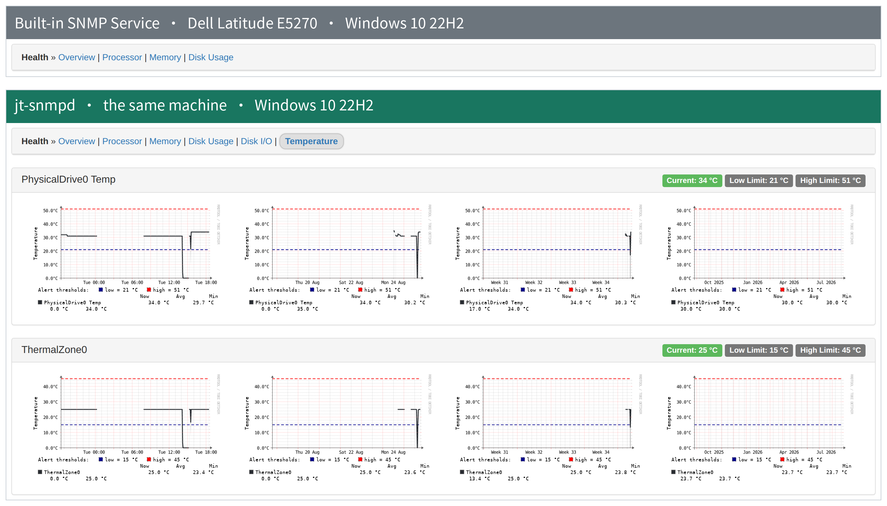
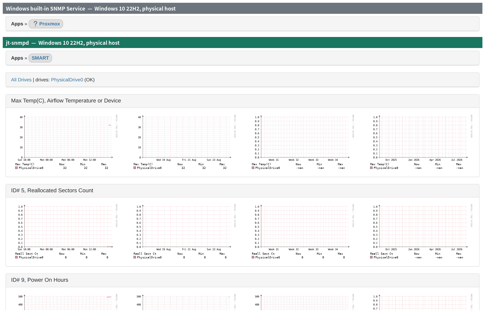
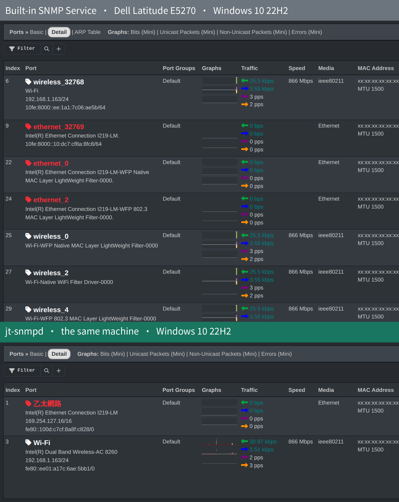
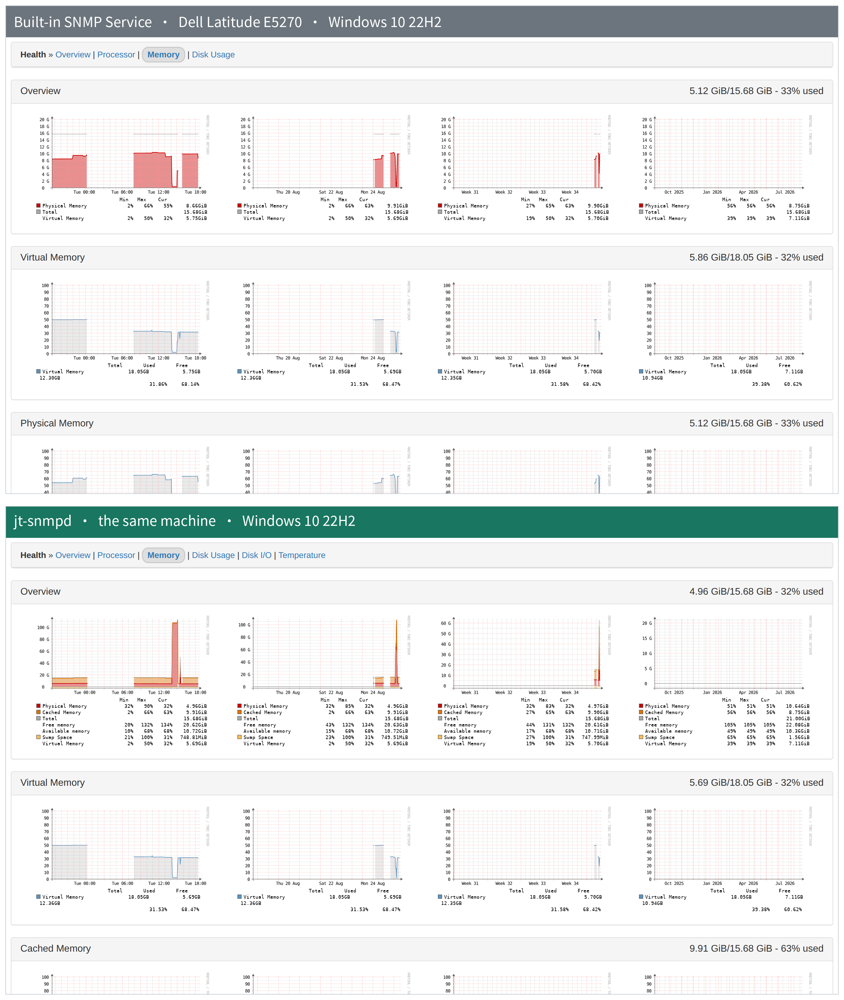

# jt-snmpd v1.0.0

[](LICENSE)


> A read-only SNMP agent for Windows that serves host monitoring data over standard
> MIBs, built to replace the deprecated built-in Microsoft SNMP Service and to feed
> LibreNMS without patching LibreNMS.
>
> By Jason Cheng (Jason Tools) · License: GPL-3.0-or-later · 繁體中文: [README_zh-TW.md](README_zh-TW.md)

> **Project page: [https://jasoncheng7115.github.io/jt-snmpd/](https://jasoncheng7115.github.io/jt-snmpd/)** — comparison screenshots, measured numbers and the design rationale, in English and Traditional Chinese.

**Security:** to report a vulnerability privately, see [SECURITY.md](SECURITY.md).

---

## Why jt-snmpd?

Microsoft deprecated the built-in SNMP Service, and Net-SNMP has no current
official Windows build. That leaves Windows hosts either unmonitored or monitored
through an agent that pushes to a time-series database — which does not help when
the NMS speaks SNMP.

jt-snmpd fills that gap with a few deliberate constraints, all driven by the target
environment (government agencies and hospitals: no outbound internet, Defender /
HVCI / WDAC commonly enforced, tens to hundreds of hosts deployed by GPO):

- **Read-only.** No SNMP SET, no traps, no writes of any kind.
- **No outbound connections, ever.** No update checks, no telemetry, no code fetched
  at runtime. The installer is fully self-contained.
- **No kernel drivers.** Disk temperature comes from native Windows IOCTLs, not from
  LibreHardwareMonitor — its WinRing0 driver is on the Microsoft vulnerable driver
  blocklist and triggers Defender on HVCI endpoints.
- **No WMI, no PowerShell subprocesses** in the data path. Collectors call Win32 APIs
  directly through ctypes.
- **Migrates from the built-in service.** Community strings, permitted managers,
  sysContact and sysLocation are picked up from the existing SNMP Service registry,
  so switching over does not mean re-entering configuration on every host.
- **Designed not to slow the host down.** Measured, not asserted — see
  [Host impact](#host-impact).

## What LibreNMS sees

Everything below is verified against a production LibreNMS 26.8.1 instance with no
LibreNMS-side patches.

| LibreNMS page | Source | Status |
|---|---|---|
| OS detection (Hardware / Version / Features) | `sysDescr` / `sysObjectID` mimicking the Microsoft format | ✅ |
| Ports | IF-MIB `ifTable` + `ifXTable` (64-bit counters), persistent `ifIndex` | ✅ |
| Processor | `hrProcessorTable` from `NtQuerySystemInformation` | ✅ |
| Memory | `hrStorage` — Physical, Virtual, Cached, Swap | ✅ |
| Disk Usage | `hrStorage` fixed disks with real volume labels | ✅ |
| Disk I/O | UCD-DISKIO from `IOCTL_DISK_PERFORMANCE` | ✅ |
| Temperature | ENTITY-SENSOR-MIB — disk temperature via SMART / NVMe | ✅ |
| Inventory | ENTITY-MIB `entPhysicalTable` parsed from SMBIOS | ✅ |
| Devices | `hrDeviceTable` — processors, NICs, physical disks | ✅ |
| IP addresses | `ipAddrTable` + `ipAddressTable` (IPv4 + IPv6) | ✅ |
| Netstats | `ip` / `icmp` / `tcp` / `udp` / `snmp` groups | ✅ |
| Agent self-health | JT private OIDs (see below) | ✅ |
| ARP / neighbours | `ipNetToPhysicalTable` | ⚙️ off by default |

### Agent self-health OIDs

This agent's failure mode is silent: the service shows *Running* while the graphs
go flat. A private OID subtree exposes the agent's own state so LibreNMS can
monitor the agent itself — version, service uptime, RSS, thread and handle counts,
snapshot age and build time, configuration source and paths, plus a per-collector
health table with status, last success, duration and cumulative error count.

Practical value: after upgrading several hundred hosts, one SNMP walk tells you
which ones did not take the new version.

### Compared with the built-in SNMP Service

A measured, side-by-side comparison against a Windows 10 host still running the
built-in Microsoft SNMP Service — including where jt-snmpd deliberately reports
*less* and why — is in
[`docs/comparison-vs-builtin-snmp.md`](docs/comparison-vs-builtin-snmp.md).

Headline, walked on the test-bed machine: the built-in service exposes 7,582
OIDs and jt-snmpd 767, but 3,999 of that gap is information disclosure that is
off by default (installed software, running processes, connection tables, ARP),
while jt-snmpd adds inventory, disk I/O, sensors, disk SMART and self-health that
the built-in service does not provide at all. These counts were taken on the test-bed machine and move with it: how much software is installed, how many processes are running and how many connections are open all feed straight into the built-in service's total.

Both halves of every figure below come from **the same machine** — a Dell
Latitude E5270 (Core i5-6300U, 16 GB, Samsung PM871b) running Windows 10 22H2,
polled by the same LibreNMS instance with no LibreNMS-side customisation. The
built-in Windows SNMP feature was installed and given UDP 161, LibreNMS
rediscovered and captured the pages, then 161 was handed back to jt-snmpd and
the same pages were captured again. Same hardware, same OS, same monitoring
server: the only variable is which agent answers.

#### Sensors

The built-in service reports no sensors at all, so LibreNMS never creates a
Temperature tab. jt-snmpd provides disk temperature and the ACPI thermal zone,
both with the thresholds the firmware itself declares.



#### Disk SMART

SMART reaches LibreNMS entirely over SNMP, through `NET-SNMP-EXTEND-MIB`. On
other platforms that application is fed by a helper script on the host that
shells out to smartmontools; jt-snmpd reads the SMART attributes itself through
`IOCTL_STORAGE_QUERY_PROPERTY`, so nothing else is installed. Attributes that
were not measured stay `null` rather than being reported as zero.

> **SMART needs one setting in LibreNMS.** The discovery module that finds it is
> off by default, so until it is enabled jt-snmpd serves the data and nothing
> collects it. In the web interface: **gear icon → Settings → Discovery →
> Discovery Modules → `applications`**, then rediscover the device. On the
> command line the equivalent is `lnms config:set discovery_modules.applications true`.
>
> **A global switch does not reach a device that has its own setting.** LibreNMS
> resolves this in the order command line, per device, per OS, global, and the
> first one that is set wins. The Modules toggle in a device's gear menu writes a
> per-device setting as soon as it is touched, so a host that was once switched
> off keeps a "no" that outranks the global "yes". For a fleet of Windows hosts,
> `lnms config:set os.windows.discovery_modules.applications true` is more precise
> than the global setting.



#### Ports

The built-in service publishes every NDIS filter driver as a separate interface;
nine of them here, automatically named and mostly meaningless. jt-snmpd
publishes hardware interfaces only, and assigns `ifIndex` from the persistent
`NET_LUID` so a driver update does not orphan the history.



#### Memory

The built-in service exposes physical and virtual memory. jt-snmpd adds cached
memory and swap, which is what fills the rest of the LibreNMS Memory page.



## Architecture

The MIB is a single array of `(OID, value)` pairs kept in lexicographic order.
`GET` is a `bisect_left`, `GETNEXT` a `bisect_right`, `GETBULK` a contiguous slice.

This is not a micro-optimisation — it makes protocol correctness structural.
Lexicographic ordering, absence of duplicate OIDs, absence of GETNEXT loops and a
correct `endOfMibView` all follow from the array being sorted, so none of them can
regress through a collector change. A test suite asserts the claim rather than
trusting it.

```
Collectors (Win32 API via ctypes)
        │
        ▼
Snapshot builder ──► sorted array + pre-encoded BER bytes
        │
        ▼ swapped in at once (one reference; a walk in progress keeps the old one)
Custom MibInstrumController      bisect
        │
        ▼
pysnmp (message / USM / VACM / transport only)
        ▲
        │
Pre-authentication gate ── source ACL → size cap → rate limit → TLV sanity
        ▲
        │
   UDP/161
```

Two consequences worth calling out:

- **Response bytes are pre-encoded when the snapshot is built.** Assembling a
  response is slicing plus concatenation, which took response encoding from
  164 µs to 0.35 µs per varbind.
- **Nothing reaches the BER decoder before the gate.** The agent runs as
  LocalSystem, so any parser bug is a SYSTEM-level bug. Source ACL, packet size
  cap, per-source token bucket and a coarse TLV check all run before pysnmp sees
  a single byte.

## Host impact

The requirement is that polling must not make the machine feel slow. That is
measured, not assumed. Under stress at roughly **7,000× the real polling rate**
(1,406 complete walks in 60 seconds) on a Windows 11 host:

| Metric | Normal priority | **Below-normal (shipped)** |
|---|---|---|
| Fixed workload degradation | 4.19% ❌ | **0.41% ✅** |
| Agent CPU | 23.4% of one core / 3.9% of machine | — |
| RSS growth over 1,406 walks | +0.12 MB | no leak |
| Threads / handles | flat | flat |

A single complete walk costs 12.5 ms of CPU. LibreNMS polls every five minutes,
so real-world usage is around **0.004% CPU**.

## Security

| Area | Approach |
|---|---|
| Threat model | The primary adversary is an attacker already inside the network, not an external scanner. The agent runs as LocalSystem, so any RCE is a SYSTEM compromise. |
| Pre-authentication | Source IP allow-list, 4096-byte packet cap, per-source token bucket, outer-TLV sanity — all before the BER decoder |
| Access control | Deny by default. The installer requires a management network; `Any/Any` is refused |
| Firewall | Inbound UDP/161 restricted to the management network, created by the installer, removed on uninstall |
| Privileges | `sc privs` drops everything but `SeChangeNotify` / `SeSystemProfile` / `SeIncreaseQuota` |
| Filesystem | Program files in `%ProgramFiles%`, state in `%ProgramData%` with ACLs reset to SYSTEM + Administrators (the default `ProgramData` ACL lets any user create subdirectories) |
| Packaging | PyInstaller **one-folder** only. One-file extracts to `%TEMP%` before executing, which is a known DLL-hijack path |
| Response size | Capped at 1400 bytes so responses never fragment |
| Information disclosure | Installed software, running processes, ARP tables and listening ports are all off by default |
| Scanning | Bandit / Semgrep / Ruff-S / pip-audit / CycloneDX SBOM, plus protocol fuzzing and Windows-specific checks — see [`docs/security-scanning.md`](docs/security-scanning.md) |

### SNMPv3

Served alongside v2c rather than in place of it, so an upgrade does not take an
existing deployment off the map. To refuse v2c outright, set `v3_only` in
`config.json`; with that set and no usable account, the service **refuses to
start** rather than listening with no way in.

Only **authPriv** is offered. A read-only agent still discloses an inventory,
software versions and an ARP table, so there is no level below it worth having.

| | Accepted |
|---|---|
| Authentication (hash) | `SHA-224` / **`SHA-256` (default)** / `SHA-384` / `SHA-512` |
| Privacy | **`AES-128` (default)** / `AES-192` / `AES-256` |
| **Refused outright** | `MD5`, `SHA-1`, `DES`, `3DES` |

Refusing them is not an omission. pysnmp implements all four, so naming one
would otherwise work — and **working is the wrong outcome**, because the
operator would believe the traffic was protected.

`AES-192` and `AES-256` are selectable but warn at startup. That is an
interoperability risk rather than a weak cipher: neither was standardised for
USM, two incompatible key-extension schemes exist, and Debian and Ubuntu build
net-snmp without the one pysnmp uses — so an agent configured that way **can be
unreachable from the very LibreNMS installation it was set up for**.

Keys are stored as **localized keys**, bound to this machine's engineID, never
as passphrases, and encrypted with **DPAPI machine scope**. Reading one
machine's secrets file buys an account on that machine, not on every machine
sharing the credential. Full details in
[SNMPv3](https://jasoncheng7115.github.io/jt-snmpd/snmpv3.html).

## Stack

| Layer | Choice |
|---|---|
| Language | Python 3.12 |
| SNMP | pysnmp 7.1 — message / USM / VACM / transport layers only; the MIB layer is replaced |
| Data sources | Win32 API via ctypes — iphlpapi, psapi, ntdll, kernel32 IOCTLs, SMBIOS, registry |
| Runtime dependencies | `pysnmp` → `pyasn1`. That is the whole list |
| Packaging | PyInstaller one-folder → self-contained `jt-snmpd.exe`, no Python on the target |
| Service | pywin32 service framework, LocalSystem, automatic start |
| Deployment | MSI (WiX v5): double-click with a settings dialog, `/qn` unattended, GPO / Intune / SCCM |

## Install

Download `jt-snmpd-<version>-x64.msi` from
[Releases](https://github.com/jasoncheng7115/jt-snmpd/releases/latest) and check
it against the `.sha256` published alongside it.

> This installer is not Authenticode signed yet, so SmartScreen warns on a
> double-click and the UAC prompt shows an unknown publisher. A certificate
> through an open-source code-signing programme is planned. For trusting it
> manually, and for WDAC and AppLocker environments, see
> [Code signing](https://jasoncheng7115.github.io/jt-snmpd/code-signing.html).

The management network is mandatory: the agent refuses to listen to `Any/Any`.

### Option 1 — double-click

The installer asks for the install location and the monitoring settings. The two
required values are the **management networks** and the **community string**;
together they decide who may query this host. It will not continue without a
management network, because an empty list means the agent answers only loopback:
installed, but not monitoring.

### Option 2 — command line and GPO deployment

This is the **command-line / unattended** form; `/qn` means no interface at all.
The same MSI and the same properties are what **Group Policy software
deployment** uses, where the installation runs as SYSTEM with no prompts.

```powershell
msiexec /i jt-snmpd-1.0.0-x64.msi /qn MANAGEMENTNETWORKS=192.168.1.0/24 COMMUNITY=your-community
```

For GPO, place the MSI on a domain file share and make sure computer accounts can
read it. Installing from an internal share also avoids the Mark of the Web, so
SmartScreen never appears.

**The built-in Windows SNMP Service is not a prerequisite.** Give the installer a
community — on the command line, or on the wizard's settings page — and it works
on a machine that has never had the built-in service. Steps 2 and 5 below happen
only when one is already there.

The installer will:

1. Check OS version, architecture, disk space and who owns UDP/161
2. **If** a Microsoft SNMP Service is present, read its configuration and carry
   over the community string, permitted managers, sysContact and sysLocation. If
   not, use the community you supplied; with neither, the installer stops and
   says so rather than inventing one
3. Stop any previous version and wait for its file handles to be released
4. Install to `%ProgramFiles%\jt-snmpd\` and create `%ProgramData%\jt-snmpd\`
   with hardened ACLs
5. **If** the built-in SNMP Service is present, disable it — **disable, not
   remove** — and record enough state to restore it
6. Register the service with failure-recovery actions and reduced privileges
7. Create the firewall rule scoped to the management network
8. Start the service and **verify it answers a loopback SNMP query** — a service
   in the *Running* state is not the same as a service that responds
9. Print a migration report and every path an administrator might need

If UDP/161 is held by something that is not the Microsoft SNMP Service, the
installer stops and leaves it alone rather than disabling a third-party agent.

### Uninstall

Through Apps & Features, or from the command line:

```powershell
# Uninstall (restores the built-in SNMP Service, keeps configuration and state)
msiexec /x jt-snmpd-1.0.0-x64.msi /qn

# Uninstall and remove everything
msiexec /x jt-snmpd-1.0.0-x64.msi /qn PURGE=1
```

If an install or uninstall will not complete,
[Manual removal](https://jasoncheng7115.github.io/jt-snmpd/manual-removal.html)
lists every step the installer performs and how to do each of them by hand.

Configuration and state are kept by default on purpose: administrators often
reinstall to troubleshoot, and discarding the interface index map would make
LibreNMS re-discover every port and orphan the historical RRDs.

## Paths

| Purpose | Location |
|---|---|
| Program files | `%ProgramFiles%\jt-snmpd\` |
| Configuration | `%ProgramData%\jt-snmpd\config.json` |
| Group Policy (overrides configuration) | `HKLM\SOFTWARE\Policies\JasonTools\JTSNMPD` |
| Interface index map | `%ProgramData%\jt-snmpd\state\index-map.json` |
| Restore information | `%ProgramData%\jt-snmpd\state\ms-snmp-restore.json` |
| Logs | `%ProgramData%\jt-snmpd\logs\` |
| Service name | `jt-snmpd` |

The same paths are reported over SNMP (`jtAgentConfigPath`, `jtAgentLogPath`,
`jtAgentInstallPath`), so "where is the configuration file" can be answered from
LibreNMS without logging into the host.

## Project layout

```
jt-snmpd/
├── deploy/          # agent source: jt_agent.py, preauth.py, smbios.py, diskhealth.py
├── packaging/       # build-exe.ps1, install.ps1, make-release.ps1
├── build/           # PyInstaller one-folder output (not in git)
├── dist/            # release artefacts (not in git)
├── tests/           # cross-platform tests — static analysis based, run on Linux CI
├── bench/gate_c/    # architecture prototype and performance measurement
└── docs/            # findings, naming decisions, security scanning, fixtures
```

## Status

| Area | State |
|---|---|
| SNMPv2c, IF-MIB, HOST-RESOURCES, UCD-DISKIO, ENTITY-MIB, ENTITY-SENSOR, IP / TCP / UDP / ICMP, self-health OIDs | ✅ verified against production LibreNMS |
| Windows service, boot start, migration from the built-in service | ✅ verified on Windows 10 and 11 |
| Disk temperature and SMART health | ✅ verified on physical hardware |
| **MSI installer** (double-click with a settings dialog, `/qn` unattended, GPO / Intune / SCCM deployment) | ✅ released; 40 lifecycle assertions covering install, upgrade, uninstall, reinstall and purge, all green on real hardware |
| SNMPv3 (SHA-256 + AES-128, authPriv) | ✅ **verified on four real machines and against a production LibreNMS**; served alongside v2c, with a `v3_only` switch |
| Authenticode signing | ⏳ planned via an open-source certificate programme — see [Code signing](https://jasoncheng7115.github.io/jt-snmpd/code-signing.html) |
| **Windows Server** | ✅ **2016 (a domain controller) and 2022 verified on real machines** — installation lifecycle, migration from the built-in service, and end to end through LibreNMS; see [Deploying to Windows Server](https://jasoncheng7115.github.io/jt-snmpd/windows-server-notes.html) |
| Read-only domain controllers | ⛔ not yet verified, no machine |
| The "Files in use" page on graphical upgrades | ⚠️ **Known defect.** Silent installation and GPO deployment are unaffected; two fixes were measured and withdrawn, see `TEST_PLAN.md` 6.1c.12 |
| Multi-homed source address selection | ⛔ not yet verified |

Not planned for v1.0: SNMP traps and informs, SNMP SET, ARM64, IPv6-only
deployments, cluster awareness.

**VACM view presets are not planned.** VACM (RFC 3415) restricts *which parts
of the OID tree* a given set of credentials can reach, and the problem it solves
does not arise here: the agent is **entirely read-only**, and what it publishes
is decided by the snapshot — no credential can reach anything that was not put
there. The tables that actually disclose something (installed software, running
processes, the ARP table, listening ports) are off by default already. A view
layer would filter a set that has already been filtered: more configuration
surface, no more control.

## License

GPL-3.0-or-later. Commercial support: contact Jason Tools.
