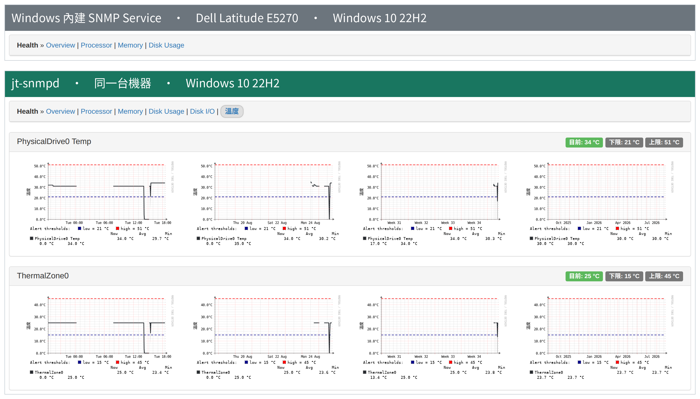
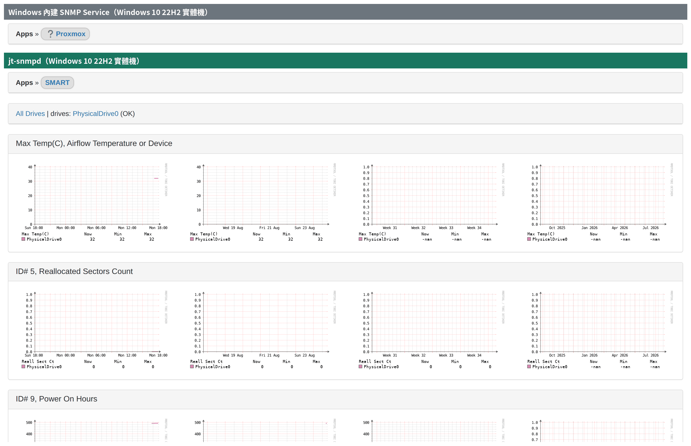
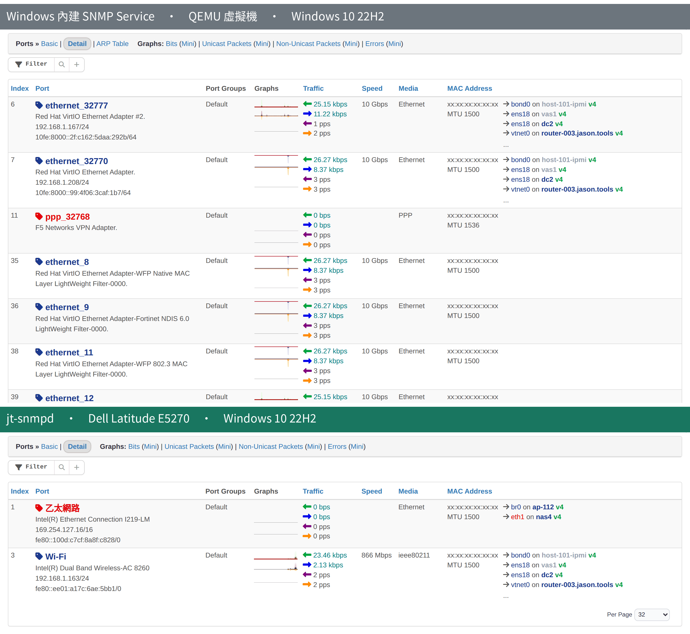
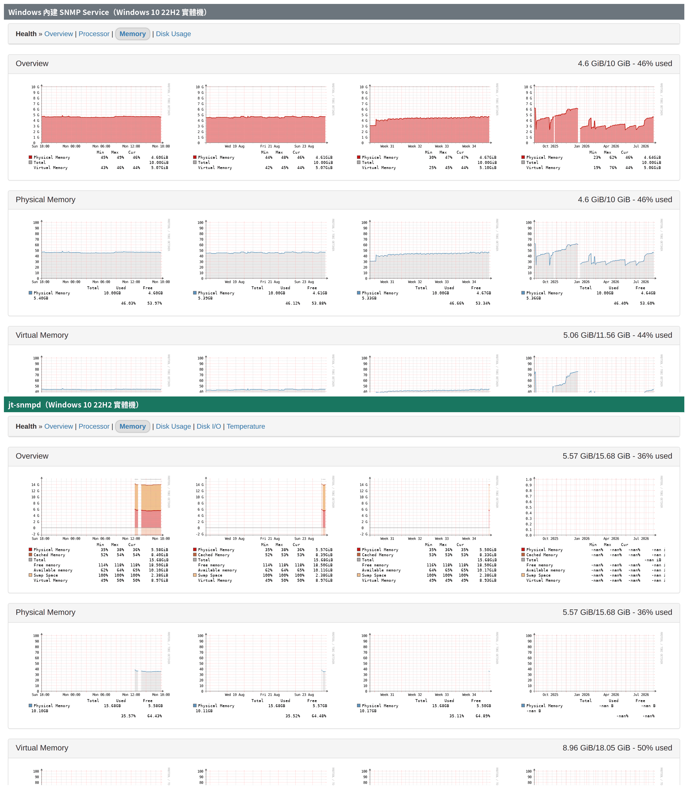

# jt-snmpd v0.9.1

[](LICENSE)


> 為 Windows 撰寫的**唯讀** SNMP Agent，以標準 MIB 提供主機監控資料。
> 用來取代已被 Microsoft 標記為停止支援的內建 SNMP Service，
> 並在不修改 LibreNMS 的前提下餵給 LibreNMS。
>
> 作者 Jason Cheng (Jason Tools) · 授權 GPL-3.0-or-later · English: [README.md](README.md)

> **專案頁面：[https://jasoncheng7115.github.io/jt-snmpd/](https://jasoncheng7115.github.io/jt-snmpd/)** —— 對照截圖、實測數字與設計取捨，英文與繁體中文可切換。

---

## 為什麼要有 jt-snmpd？

Microsoft 已停止支援內建的 SNMP Service，而 Net-SNMP 也沒有現行的官方 Windows
建置。結果是 Windows 主機要嘛沒被監控，要嘛只能改用「主動推送到時序資料庫」的
agent——但當 NMS 講的是 SNMP 時，那並不能解決問題。

jt-snmpd 填補這個缺口，並帶著幾條刻意的限制，全部來自目標環境
（政府機關與醫院：無對外網路、Defender / HVCI / WDAC 普遍啟用、
數十到數百台以 GPO 部署）：

- **唯讀。** 不支援 SNMP SET、不發 trap、不做任何寫入。
- **絕不主動對外連線。** 不檢查更新、不回報遙測、不在執行時下載任何程式碼。
  安裝包完全自包含。
- **不依賴核心驅動程式。** 磁碟溫度走 Windows 原生 IOCTL，**不用**
  LibreHardwareMonitor——它依賴的 WinRing0 驅動已列入 Microsoft
  vulnerable driver blocklist，在啟用 HVCI 的端點上會觸發 Defender 告警。
- **資料路徑不用 WMI、不用 PowerShell 子行程。** collector 以 ctypes 直接呼叫
  Win32 API。
- **從內建服務移轉設定。** community、允許的管理主機、sysContact、sysLocation
  都會從既有的 SNMP Service 登錄檔沿用，換過來不必在每台機器重新填一次。
- **設計上就不該拖慢主機。** 這是量測出來的，不是講出來的——見
  [對主機的影響](#對主機的影響)。

## LibreNMS 上會看到什麼

以下全部在正式的 LibreNMS 26.8.1 上驗證過，且**不需要對 LibreNMS 打任何 patch**。

| LibreNMS 頁面 | 資料來源 | 狀態 |
|---|---|---|
| OS 偵測（Hardware / Version / Features）| 模仿 Microsoft 格式的 `sysDescr` / `sysObjectID` | ✅ |
| 連接埠 | IF-MIB `ifTable` + `ifXTable`（64-bit 計數器），持久化 `ifIndex` | ✅ |
| Processor | `hrProcessorTable`，來源 `NtQuerySystemInformation` | ✅ |
| Memory | `hrStorage` —— 實體、虛擬、快取、分頁檔 | ✅ |
| Disk Usage | `hrStorage` 固定磁碟，含真實磁碟區標籤 | ✅ |
| Disk I/O | UCD-DISKIO，來源 `IOCTL_DISK_PERFORMANCE` | ✅ |
| 溫度 | ENTITY-SENSOR-MIB —— 磁碟溫度，走 SMART / NVMe | ✅ |
| Inventory | ENTITY-MIB `entPhysicalTable`，解析 SMBIOS 而得 | ✅ |
| 設備 | `hrDeviceTable` —— 處理器、網路卡、實體磁碟 | ✅ |
| IP 位址 | `ipAddrTable` + `ipAddressTable`（IPv4 + IPv6）| ✅ |
| Netstats | `ip` / `icmp` / `tcp` / `udp` / `snmp` 群組 | ✅ |
| Agent 自我健康 | JT 私有 OID（見下）| ✅ |
| ARP / 鄰居 | `ipNetToPhysicalTable` | ⚙️ 預設停用 |

### Agent 自我健康 OID

這個 agent 的失效是**無聲的**：服務顯示「執行中」，而圖表卻是平的。
因此我們用一組私有 OID 把 agent 自己的狀態暴露出來，讓 LibreNMS
可以監控 agent 本身——版本、服務執行時間、RSS、執行緒與 handle 數、
快照年齡與建立耗時、設定來源與各路徑，加上一張逐 collector 的健康表
（狀態、上次成功時間、耗時、累計錯誤數）。

實際價值：升級數百台之後，**一次 SNMP walk 就知道哪幾台沒升級成功**。

### 與內建 SNMP Service 的對照

我們在一台仍使用 Windows 內建 SNMP Service 的 Windows 10 主機上做了逐項量測對照，
**包含 jt-snmpd 刻意回報「更少」的地方與原因**，見
[`docs/comparison-vs-builtin-snmp.md`](docs/comparison-vs-builtin-snmp.md)。

摘要：內建服務暴露 6,507 個 OID、jt-snmpd 為 776，但這個差距中有 3,175 個
屬於預設關閉的資訊揭露（已安裝軟體、執行中程序、連線表、ARP），
而 jt-snmpd 另外提供了內建服務完全沒有的 inventory、Disk I/O、感測器、
磁碟 SMART 與自我健康。

以下兩台都是實體機、都是 Windows 10 22H2，由同一套 LibreNMS 監控，
LibreNMS 端未做任何客製。

#### 感測器

內建服務完全不回報感測器，所以 LibreNMS 根本不會建立「溫度」頁籤。
jt-snmpd 提供磁碟溫度與 ACPI 熱區，兩者都帶著韌體自己宣告的門檻值。



#### 磁碟 SMART

SMART **完全透過 SNMP** 送達 LibreNMS，走 `NET-SNMP-EXTEND-MIB`——
被監控端不需要 LibreNMS agent，也不需要 smartctl。
沒量到的屬性保持 `null`，不會以 0 回報。

> 需要在 LibreNMS 啟用 `discovery_modules.applications`，它預設是 `false`。
>（內建那台顯示的 `Proxmox` 是先前探索留下的誤判，與本對照無關——
> 內建服務並不提供任何 SMART 資料。）



#### 連接埠

內建服務把每一個 NDIS 過濾驅動都當成獨立介面輸出，這台就有九個，
全是自動命名、看不出用途的項目。jt-snmpd 只輸出實體網路介面，
並以持久的 `NET_LUID` 配發 `ifIndex`，更新驅動不會讓歷史資料變成孤兒。



#### 記憶體

內建服務提供實體與虛擬記憶體。jt-snmpd 另外提供快取記憶體與 Swap，
那是 LibreNMS 記憶體頁其餘欄位的來源。



## 架構

整份 MIB 是一個依 OID 字典序排好的 `(OID, 值)` 陣列。
`GET` 是一次 `bisect_left`、`GETNEXT` 是一次 `bisect_right`、
`GETBULK` 是一段連續切片。

這不是微幅調校，而是**讓協定正確性變成結構性質**。字典序、無重複 OID、
無 GETNEXT 迴圈、正確的 `endOfMibView`，全都直接來自「陣列是排序的」這件事，
所以不會因為某個 collector 改動而悄悄退步。測試套件負責驗證這個聲稱，
而不是相信它。

```
Collectors（以 ctypes 呼叫 Win32 API）
        │
        ▼
Snapshot builder ──► 排序陣列 + 預先編碼好的 BER 位元組
        │
        ▼ 原子換手（參考指派）
自訂 MibInstrumController        bisect
        │
        ▼
pysnmp（只負責 message / USM / VACM / transport）
        ▲
        │
前置解析閘門 ── 來源 ACL → 大小上限 → 速率限制 → TLV 合法性
        ▲
        │
   UDP/161
```

其中兩點值得特別說明：

- **回應的位元組在建立快照時就編碼好了。** 組一個回應只剩切片與串接，
  這讓回應編碼從 164 µs 降到每個 varbind 0.35 µs。
- **在閘門之前，沒有任何位元組會到達 BER decoder。** agent 以 LocalSystem
  執行，任何解析器漏洞都等同 SYSTEM 層級的漏洞。來源 ACL、封包大小上限、
  每來源 token bucket、外層 TLV 檢查，全部在 pysnmp 看到第一個位元組之前執行。

## 對主機的影響

要求是「poll 的時候不能讓機器變慢」。這是量測出來的，不是假設的。
在 Windows 11 主機上以**約 7,000 倍的真實輪詢速率**施壓
（60 秒內 1,406 次完整 walk）：

| 指標 | Normal 優先權 | **BelowNormal（實際採用）** |
|---|---|---|
| 固定工作負載退化 | 4.19% ❌ | **0.41% ✅** |
| agent CPU | 單核 23.4% / 整機 3.9% | — |
| 1,406 次 walk 後 RSS 成長 | +0.12 MB | 無洩漏 |
| 執行緒 / handle | 平坦 | 平坦 |

單次完整 walk 的成本是 12.5 ms CPU。LibreNMS 每五分鐘 poll 一次，
換算到實際使用約為 **0.004% CPU**。

## 資訊安全

| 面向 | 做法 |
|---|---|
| 威脅模型 | 主要對手是**已經在內網的攻擊者**，不是外部掃描。agent 以 LocalSystem 執行，任何 RCE 直接等同 SYSTEM 被攻陷 |
| 前置認證 | 來源 IP 白名單、4096 位元組封包上限、每來源 token bucket、外層 TLV 合法性——全部在 BER decoder 之前 |
| 存取控制 | 預設 deny。安裝時必須提供管理網段，`Any/Any` 會被拒絕 |
| 防火牆 | 入向 UDP/161 限制在管理網段，由安裝程式建立，解除安裝時移除 |
| 特權 | 以 `sc privs` 只保留 `SeChangeNotify` / `SeSystemProfile` / `SeIncreaseQuota` |
| 檔案系統 | 程式在 `%ProgramFiles%`，狀態在 `%ProgramData%` 且 ACL 重設為 SYSTEM + Administrators（`ProgramData` 的預設 ACL 允許任何使用者建立子目錄）|
| 打包 | 只用 PyInstaller **one-folder**。one-file 會先解壓到 `%TEMP%` 再執行，那是已知的 DLL 劫持路徑 |
| 回應大小 | 上限 1400 位元組，回應永不分片 |
| 資訊揭露 | 已安裝軟體、執行中程序、ARP 表、監聽埠一律預設停用 |
| 掃描 | Bandit / Semgrep / Ruff-S / pip-audit / CycloneDX SBOM，加上協定層 fuzzing 與 Windows 專屬檢查——見 [`docs/security-scanning.md`](docs/security-scanning.md) |

## 技術組成

| 層 | 選擇 |
|---|---|
| 語言 | Python 3.12 |
| SNMP | pysnmp 7.1 —— 只用它的 message / USM / VACM / transport 層，MIB 層由我們取代 |
| 資料來源 | 以 ctypes 呼叫 Win32 API —— iphlpapi、psapi、ntdll、kernel32 IOCTL、SMBIOS、登錄檔 |
| 執行時相依 | `pysnmp` → `pyasn1`。就這樣 |
| 打包 | PyInstaller one-folder → 自包含的 `jt-snmpd.exe`，目標機不需安裝 Python |
| 服務 | pywin32 服務框架，LocalSystem，自動啟動 |
| 部署 | 目前為 ZIP + PowerShell 安裝程式；MSI（WiX）供 GPO / Intune / SCCM |

## 安裝

需要以系統管理員身分執行 PowerShell。**管理網段是必填的**——
agent 不接受監聽 `Any/Any`。

```powershell
# 解開發佈壓縮檔後：
.\install.ps1 -ManagementNetworks 192.168.1.0/24
```

安裝程式會：

1. 檢查 OS 版本、架構、磁碟空間，以及 UDP/161 目前由誰佔用
2. 讀取既有的 Microsoft SNMP Service 設定，沿用 community、允許的管理主機、
   sysContact 與 sysLocation
3. 停止任何舊版本，並**等待其檔案控制代碼真的釋放**
4. 安裝到 `%ProgramFiles%\JT SNMP Agent\`，建立 `%ProgramData%\JT-SNMP\`
   並收緊 ACL
5. 停用內建 SNMP Service——是**停用，不是移除**，並記錄足以還原的資訊
6. 註冊服務，設定失效自動復原與特權縮減
7. 建立僅限管理網段的防火牆規則
8. 啟動服務並**確認它真的回應 loopback SNMP 查詢**——
   服務處於「執行中」不等於服務會回應
9. 輸出移轉報告，以及管理員可能需要的每一個路徑

若 UDP/161 被「非 Microsoft SNMP Service」的程式佔用，安裝程式會**中止並且
不動它**，而不是去停用第三方 agent。

```powershell
# 解除安裝（還原內建 SNMP Service，保留設定與狀態）
.\install.ps1 -Uninstall

# 解除安裝並清除全部資料
.\install.ps1 -Uninstall -Purge
```

預設保留設定與狀態是刻意的：管理員常以「移除再重裝」來排除問題，
若把介面索引映射一起清掉，LibreNMS 會重新 discovery 每一個 port，
舊的歷史 RRD 全部變成孤兒。

## 路徑

| 用途 | 位置 |
|---|---|
| 程式本體 | `%ProgramFiles%\JT SNMP Agent\` |
| 設定檔 | `%ProgramData%\JT-SNMP\config.json` |
| 群組原則（優先於設定檔）| `HKLM\SOFTWARE\Policies\JasonTools\JTSNMPD` |
| 介面索引映射 | `%ProgramData%\JT-SNMP\state\index-map.json` |
| 還原資訊 | `%ProgramData%\JT-SNMP\state\ms-snmp-restore.json` |
| 記錄檔 | `%ProgramData%\JT-SNMP\logs\` |
| 服務名稱 | `jt-snmpd` |

同一組路徑也透過 SNMP 回報（`jtAgentConfigPath`、`jtAgentLogPath`、
`jtAgentInstallPath`），所以「設定檔在哪」可以直接從 LibreNMS 查到，
不必登入那台主機。

## 專案結構

```
jt-snmpd/
├── deploy/          # agent 原始碼：jt_agent.py、preauth.py、smbios.py、diskhealth.py
├── packaging/       # build-exe.ps1、install.ps1、make-release.ps1
├── build/           # PyInstaller one-folder 產物（不進 git）
├── dist/            # 發佈成品（不進 git）
├── tests/           # 跨平台測試——以靜態解析為基礎，可在 Linux CI 上跑
├── bench/gate_c/    # 架構原型與效能量測
└── docs/            # 查證結果、命名決策、資安掃描、fixtures
```

## 目前狀態

| 項目 | 狀態 |
|---|---|
| SNMPv2c、IF-MIB、HOST-RESOURCES、UCD-DISKIO、ENTITY-MIB、ENTITY-SENSOR、IP / TCP / UDP / ICMP、自我健康 OID | ✅ 已在正式 LibreNMS 驗證 |
| Windows 服務、開機自啟、從內建服務移轉 | ✅ 已在 Windows 10 與 11 驗證 |
| 含健康檢查閘門的 PowerShell 安裝程式 | ✅ 已驗證，含升級路徑 |
| 磁碟溫度與 SMART 健康度 | ✅ 已在實體硬體驗證 |
| SNMPv3（SHA-256 + AES-128）| ⛔ 未實作 |
| VACM 檢視預設集 | ⛔ 未實作 |
| 供 GPO / Intune / SCCM 使用的 MSI | ⛔ 未實作 |
| Authenticode 簽章 | ⛔ 待 SignPath |
| Windows Server、Server Core、網域控制站 | ⛔ 尚未驗證 |
| 多網路卡來源位址選擇 | ⛔ 尚未驗證 |

v1.0 不列入計畫：SNMP trap 與 inform、SNMP SET、ARM64、純 IPv6 部署、
叢集感知。

## 授權

GPL-3.0-or-later。商業支援請洽 Jason Tools。
